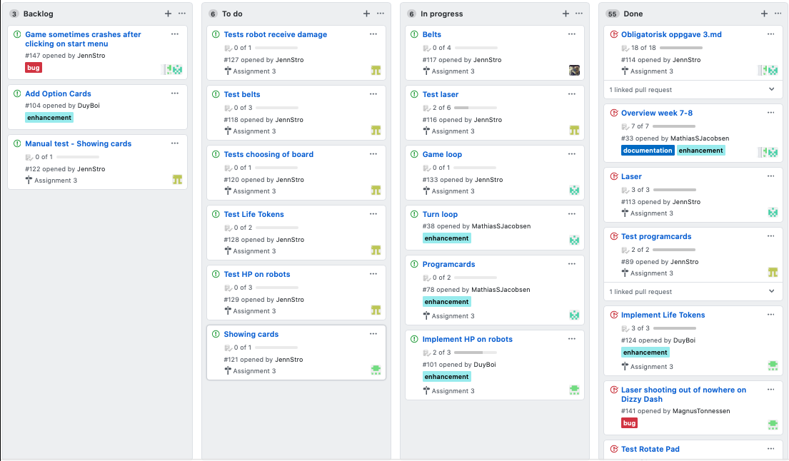

# Mandatory Assignment 3 
Team: error_no_brain_found

## Task 1 - Team and project
### Meeting minutes
[Møte 4](https://github.com/inf112-v20/error_brain_not_found/wiki/Møte-4.)  
[Møte 5](https://github.com/inf112-v20/error_brain_not_found/wiki/Møte-5.)   
[Møte 6](https://github.com/inf112-v20/error_brain_not_found/wiki/Møte-6)  
[Møte 7](https://github.com/inf112-v20/error_brain_not_found/wiki/Møte-7)  

The meeting minutes ended up looking a bit lack of words. Since we was more busy with doing code, explaining code to each
other, and handout `Issues` to everyone, in the meeting. 

### Roles
The roles in the team work ok. The teamleader takes responsibility of tasks like how to perform meetings in this new 
situation, takes initiatives for making meeting minutes and so on. The teamleader and customer contact 
have been developing code, the tester has been making tests to this code. Also the UX designer has started to work on his tasks.
We do not want to change teamlead or contact.  
For more depth information on the roles see [ObligatoriskOppgave2](https://github.com/inf112-v20/error_brain_not_found/blob/develop/Deliverables/Obligatorisk%20Oppgave2/ObligatoriskOppgave2.md),
under `Roles`.

### Experiences with the team or project-methods   
We are getting better at using issues, tags in issues and the projectboard. When a task needs to be done, 
we make user stories, acceptance criteria's and tasks. This is copied into the issue, and the tasks are made as 
check boxes so that we can see progress in the issue. Also an own issue for tests for this task is made and is tagging the issue 
it should be testing, with acceptance criteria as tests to be made. This gives us a great overview of who is doing what, 
and a great workflow because we can always see what to do next.

### Do you think you have made good choices? If not, explain  
In general yes, we think it was smart to device the team into roles like Developers, Tester etc, because then everyone know
what to do. On the other hand, these roles have some overlap, for example that maybe the tester sees something that needs to be fixed, can not 
reach some code, or that the developer/UX-designer needs a specific test. We are then assigning issues to each other and specify the task needs 
to be done, but sometimes this results in a lot of waiting for the person requesting these changing and the person needs to get this done before 
doing anything else. We have discussed how this can be handled, and agreed on that small fixes can be done even though it is not 
your area of responsibility.

### Retrospective
Working in this iteration has been different. We have not been able to meet in person and all our communication has moved 
online. This have come with its own pros and cons. It took some time for everyone to get used to the new situation, so the first 
week after the "campus-ban" wasn't the most productive. When everyone got in to the new situation we started to make the
best of it. When people need help about something, they send someone in the team a message. And they often get the 
answer faster now then what they did before. Meetings are going fine for now, but it will be harder as longer this ban
keeps on. I think the way we parted the roles and made us survived the transition in a good way. Every role has one main
responsibility area. When you have to move closer to someone else's area and you meet a wall we are fast to help each other 
out. Also we have agreed on that if it is small changes/additions, this can be fixed even though it is not you area. 

We have have some work to do on planing what specific elements of the project need, so every member of the group have what
they need. In some cases the test require specific methods, that the tester often has to ask for. So if we start planing better 
when we get the idea, we think this could delete that obstacle.

The group is more proactive now and uses the `Project Board` more to see what needs to be done. When they are finished with their
task, and have some time leftover, they find something on the board like a `Bug` or something in the `Backlog`. They also communicate
this to the team, so everyone in the team have an idea of what is going on at the same time. So we feel the communication in 
the team is getting better.

#### Improvement points from retrospective
*   Make concrete tasks for each user story.   
*   Fix small changes even though it is not you area.  
*   Follow up issues on project board.  

### Prioritization in the future
This iteration we have prioritized, and are done with:  
*   Holes: when a player is on hole it is respawned  

*   Lasers: making them work properly (get stopped by player and let player take damage)    

*   Damage: Let player take damage  

*   Game loop: When space is pressed the players use their programcards.  

*   Menu-screen: Choose different boards for the game  

*   Flags: Let the player pick up flags so it can win    

*   Rotatepad: rotate a player on a rotatepad  

We have prioritized to get each component of the game to work properly (walls, lasers), so that we can make 
a working game loop with all the different parts working together.   

Next iteration we will focus on:  
*   Show cards: Let the player see the cards on the screen   
*   Belts: Make belts   
*   Game loop:  Get a working game loop  

### Group dynamic and communication
In general communication works fine, we communicate over slack and assign tasks to each other by making 
issues and add them to project board. As mentioned before, because some overlapping of the different roles in the team, 
it can be a bit challenging to wait for others to respond when you are working on something. Most of the team are communicating 
great over slack and are doing tasks assigned to them, but we can not get a hold of one of the team-members. We assign issues with tasks and 
follow up with message over slack, but experience very little to no feedback.

## Task 2 - Requirements
### User stories:
#### Holes 

User story:  
As a player I want to respawn if I end up on a hole, so that I can continue the game from backup.

Acceptance-criteria:  
*   If I go on a tile where there is a hole I want to be respawned at my backup.  

Tasks:  
*   Make a method that tells if you are on a hole     
*   Test that you are respawned when on a hole   

#### Laser
User-story:
As a player I want the laser to be able to hit me, so that I take damage.

Acceptance-criteria: 
*   If a laser is activated and player is standing in its shooting line, it gives player damage.
*   If a laser is activated and player is not standing in its shooting line, it does not give player damage.

Tasks:
*   Make a method that tells if a laser is hitting a player 
*   Make a method that makes the player take damage 
*   Make tests for when laser is hitting player

User-story:
As a player I want the laser not to hit me when it is blocked by objects on the board, so that I do not take damage.

Acceptance-criteria: 
If a laser is activated and player is standing in its shooting line but is blocked, then player does not get damage.

Tasks:
*   Make a method to tell if a laser is blocked, or make laser object know how far it can go by checking board.
*   Test if the range of the specific laser is correct.
*   Test that a player is not damaged when out of range of laser. 

#### Belts
User-story:
As player standing on a belt, I want to be moved as many steps as the belt is moving, so that I can get closer to my goal.

Acceptance-criteria:
*   If a player is standing on a belt and the belt is moving, then the player will move.
*   If a player is on a belt, it moves as many steps as the belt does (express or regular)

Tasks:
*   Make a method to tell if you are on a belt. 
*   Let the belt know if it should move or not and how fast it should go
*   Make a method to move any player on the belt

User-story:
As a player standing on a belt, I want to be moved in the same direction the belt is moving, so that I can stay on the belt.

Acceptance-criteria:
*   If a player is standing on the corner and the belt is moving, then the player changes direction with the belt.

Task:
*   Make a method to tell if player is on the corner of the belt and what direction it 
should have

**NOT FINNISHED**, will be continued to next sprint.

#### RotatePads
User-story:
As a user I want to get turned if I walk on a rotate pad

Acceptance-criteria:
when I move to a tile with a rotate-wheel I want to be turned in the direction of the rotate pad

Tasks:
*   make a method that tells if player i on rotate pad and then rotate player 
*   test that player is rotated in correct direction

#### MenuScreen
User-Story:
As a user of the game I want to be able to choose different board layouts, so that I can have a new challenge in the game.

Acceptance-criteria:
If I choose a board-layout, this is the layout that shows when I start the game

Tasks:
*   Make methods for choosing board
*   Make graphics for choosing board

#### Life on robots
User-Story:
As a player I want my robot to be able to take damage, so that my robot can die

Acceptance-criteria:
If a laser hits me, I want to recieve damage

Tasks:
Make methods for robots to take damage

#### Damagetoken
User-Story:
As a player I want my robot to have a Token-bar, to see when or if my robot gets hurt

Acceptance-criteria:
*   When i get 10 damage tokens, I want my robot to die and respawn
*   When i get 5 or more damage tokens, then the program cards will 'lock up' starting from register 5
*   When i get x damage tokens, I will get x less program cards

Tasks:
*   Make a GUI for visible damage tokens for the robots
*   Make methods to recieve damage tokens
*   Make methods to recieve less programs cards based on damage tokens

#### Lifetoken
User-Story: 
As a player I want to have Life tokens, to see how many lives I have left

Acceptance-criteria:
*   If my robot gets 10 damage tokens, I lose a life token
*   If my life tokens are depleted, then im permanently out of the game

Tasks:
*   Make a GUI to visualize life tokens
*   Make a method that removes life tokens when robots die.    
*   Make a method that robots do not respawn after losing all life tokens

#### See the cards
User-story:
As a player I want to be able to see the cards, so that I can plan my program. 

Acceptance-citeria:
*   When I have drawn the cards, the cards are displayed in front of me on the screen.

Tasks:
*   Make graphics for showing cards 
*   Manual test

This is not done, will continue on next sprint

#### Flags 
User-story:
As a user I want to go on flags, so that I can win the game. 

Acceptance-criteria:
*   If I go on a flag, this flag is picked up.
*   If I pick up all flags in correct order, I win.
*   If I pick up flags in incorrect order, the flag is not picked up.

Tasks: 
*   Create a function to tell i you can pick up a flag 
*   Create flags with flagnumber and position 
*   Check if all flags are picked up in correct order 
*   Make tests for flags 

#### Game loop
User-story:
As a player I want the game to go in a loop, so that events happen in a specific order. 

Acceptance-criteria:
When the game starts, it goes through the fases and the rounds. 

Tasks:
*   Make loop for the game. 
*   Test that events happen in right order
*   Manual tests   

A testing version is up, but this is going to be continued on next sprint.

#### Main criteria for MVP
* [x]   The game should be able to run, show a board with starting robot and programcards to this robot.  
* [ ]   The player is able to pick programcards and place them so that the robot can move.  
* [ ]   The game should be able to do a round, and do the phases in the correct order in that round.  
* [x]   The robot should be able to win by going to the flags in a specific order.   
* [x]   The robot is stopped by walls, pushed by other players and respawned when outside board/on hole.   
* [ ]   The robot should be able to do a powerdown.  
* [x]   The laser can shoot the robots and the robots take damage.   
* [ ]   The belts move so the player can be moved by belts.  

## Task 3 - Productdelivery and codequality
### Manual tests
The start-screen goes away after clicking on it. 
*   start the game then click somewhere on the screen. Then the menu-screen should come.  

Game loop:  
*   When the game has started press space once.
*   Then all robots will use one programcard in turn, 5 times. (5 rounds) 
*   Press space again after all robots have moved and the robots will do five more rounds.   

Laser:  
*   Press on of the keyboard-arrows and the lasers will be activated. 
*   Stear your player in front of a laser. The laser should be stopped by a player.   

Menu-screen:  
*   Click on the start-menu (a picture). Then a screen with a roll-down menu and start and exit buttons should show.   
*   Choose your board by choosing from the roll-down menu then click start. The board should show with players on it.

### Bugs
Game sometimes crashes after clicking on start menu

### Comment to automatic build tests
Travis does not support the language `Java` on their Windows Build Environment. But 3/5 in our group run windows and it 
runs on their computer.  

### Comment to classdiagram
The project is getting big so the diagram is no only the classes, if you want to se the content of the classes in the UML
there is possible to put it on in the `ClassDiagramMandatoryAssignment3.uml` in the `Deliverables/Obligatorisk Oppgave3`
folder.
