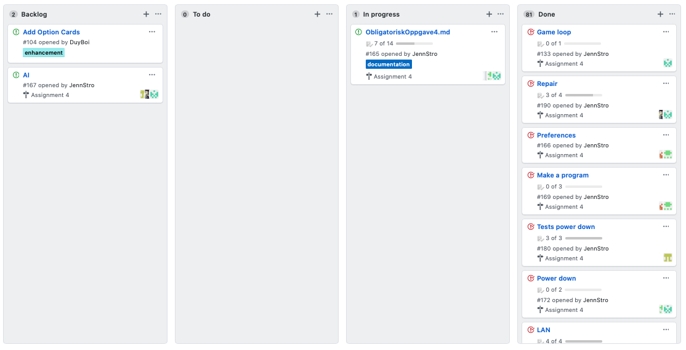

# Mandatory Assignment 3 
Team: error_no_brain_found

## Task 1 - Team and project
### Meeting minutes

[Meeting 8](https://github.com/inf112-v20/error_brain_not_found/wiki/Møte-8)  
[Meeting 9](https://github.com/inf112-v20/error_brain_not_found/wiki/Møte-9)  
[Meeting 10](https://github.com/inf112-v20/error_brain_not_found/wiki/Møte-10)  
[Meeting 11](https://github.com/inf112-v20/error_brain_not_found/wiki/Møte-11)  
[Meeting 12](https://github.com/inf112-v20/error_brain_not_found/wiki/Møte-12)  
[Meeting 12.5](https://github.com/inf112-v20/error_brain_not_found/wiki/Møte-12.5), this was not meant as a meeting just
catchup before the presentation.  
[Meeting 13](https://github.com/inf112-v20/error_brain_not_found/wiki/Møte-13)

### Roles
The roles in the team is fine. The team leader have the over all control over the team. He is making sure everyone
contributes, and does what they are suppose to in the given time frame. For the rest of the team, people still have their
responsibility area. Since we are in the last sprint of the project the lines between the roles are a bit wiped out and 
people are helping where it is needed to get finished. 
 
For more depth information on the roles see [ObligatoriskOppgave2](https://github.com/inf112-v20/error_brain_not_found/blob/develop/Deliverables/Obligatorisk%20Oppgave2/ObligatoriskOppgave2.md),
under `Roles`.

### Experiences with the team or project-methods
We are getting better at using issues, tags in issues and the projectboard. When a task needs to be done, 
we make user stories, acceptance criteria's and tasks. This is copied into the issue, and the tasks are made as 
check boxes so that we can see progress in the issue. Also an own issue for tests for this task is made and is tagging the issue 
it should be testing, with acceptance criteria as tests to be made. This gives us a great overview of who is doing what, 
and a great workflow because we can always see what to do next.

### Retrospective from the project  
**Project methods:**  
We initially started with a mix of Kanban, Scrum and Extreme Programming. We have been using a Kanban board, and most of 
the time limited the issues in the In Progress block: In the meetings we have discussed what needs to be done until next 
time and tried to share tasks among team-members evenly, so the progress board is limited. The visualization of tasks using 
Kanban has been very valuable to us because we can see progress. Also it made it easier for the team to collaborate, 
because every one knows what other team members do.   
We have been using Scrum by defining clear roles and areas of responsibility in the team. Also we have worked with sprints 
every one week (every meeting), and focused on the backlog of the project, not so much about what is in progress. We have not
been using Daily Scrum, but have had generally good communication between meetings. Initially we wanted to use XP to ensure 
testing before every commit. We have been testing new code regularly and often, but maybe not before each and every commit. 
However we have been using other elements from XP like pair-programming, Continous integration (using Travis CI) and 
weekly iterations (or sprints in Scrum).    

We have been working mainly with defined areas of responsibility, but we have also been helping each other across the 
roles that we have. This has been beneficial to us because we can easier adopt our code to match the other ones needs,
and often think about other members should use your code.   

**The project:**  

### Project board

### Group dynamic and communication   
We communicate much better then in the beginning of the semester, even though it is only over internet because of corona. 
We discuss more freely about how to solve problems that arise when working on a task, and teammembers do not hesitate to 
ask for help from the others. The dynamic is better; every one in the team is contributing to their field, and when a member is
 assigned to a task it is trusted that he/she does it properly, or ask for help if she/he gets stuck. After corona, we 
 have moved all communications to Slack, and this has worked very well. We have been discussing code and specific tasks 
 through chat and helped each other. All in all we have learned a lot about how important it is to communicate and get others 
 oppinions or solutions when you are working on a project, and not struggle with it yourself. Also we have learned a lot about 
 the importancy of writing clear code with good names and proper documentation, so other members can easily understand what 
 you have done.  

## Task 2 - Requirements
### User-stories 

#### Belts
User-story:
As player standing on a belt, I want to be moved as many steps as the belt is moving, so that I can get closer to my goal.

Acceptance-criteria:
*   If a player is standing on a belt, and the belt is moving, then the player will move.
*   If a player is on a belt, it moves as many steps as the belt does (express or regular)

Tasks:
*   Make a method to tell if you are on a belt. 
*   Let the belt know if it should move or not and how fast it should go
*   Make a method to move any player on the belt

User-story:
As a player standing on a belt, I want to be moved in the same direction the belt is moving, so that I can stay on the belt.

Acceptance-criteria:
*   If a player is standing on the corner and the belt is moving, then the player changes direction with the belt.

Task:
*   Make a method to tell if player is on the corner of the belt and what direction it 
should have

#### See the cards
User-story:
As a player I want to be able to see the cards, so that I can plan my program. 

Acceptance-citeria:
*   When I have drawn the cards, cards are displayed in front of me on the screen.

Tasks:
*   Make graphics for showing cards 
*   Manual test

#### Make a program  
User-story:  
As a user I want to be able to arrange the cards, so that I can make a program for my robot.  

Acceptance-criteria:  
*   If I rearrange the cards, the cards are played in this order.  

Tasks:  
*   Create a method that takes input from screen and update how the cards are arranged in the player.  
*   Create a function that "lock" the cards, so the user can tell the game the program to be made is done.  
*   Create a method that lets the user rearrange the cards given.  

#### Game loop
User-story:
As a player I want the game to go in a loop, so that events happen in a specific order. 

Acceptance-criteria:
When the game starts, it goes through the fases and the rounds. 

Tasks:
*   Make loop for the game. 
*   Test that events happen in right order
*   Manual tests  

#### GUI for LAN   
User-story:  
As a user I want to be able to write in port-number and numbers of players in a game, so that I can host a game on my computer. 

Acceptance-criteria:  
When port-number and number of players is given, a server will start waiting for given players to connect. 

Tasks:  
*   Create input fields  
*   Connect input to back-end  
*   Manual tests   

#### Repair  
User-story:  
As a player I want to stand on a repair-tile, so that I can get rid of my damage tokens.  

Acceptance-criteria:  
When the round is finished, if I stand in a repair-tile, my damage tokens are removed.  

Tasks:  
*   Create a function to find repair tiles on board  
*   Create class for repair  
*   Create method for removing damage tokens  
*   Create method for knowing when a robot is on repair

User-story:  
As a user I want to be able to write in IP-number and portnuber in a game, so that I can join a game hosted by another computer. 

Acceptance-criteria:  
When IPnumber and portnumber is given, a connection will be made if the given IPnumber is accepting connection on the portnumber given. 

Tasks:  
*   Create input fields  
*   Connect input to back-end  
*   Manual tests   

#### Mute button
User-story:
As a user I want to be able to mute the game, so I can choose to have sound or not.

Acceptance-criteria:
When I hit "m", there is no sound from the game.

Tasks:
*   Make method for muting the game. 

#### Preferences  
User-story:  
As a user I want to be able to control the game volume, so I can adjust the volum to a comfortable level.  

Acceptance-criteria:
*   When I turn down volume, the sound goes down.  
*   When I turn up volume, the sound goes up. 

Tasks:  
*   Create method for turning up/down volume. 
*   Manuel tests.  

#### AI 
User-story:  
As a user I want to be able to play against the machine, so that I can play the game alone.  

Acceptance-criteria:  
*   When I play the game the computer plays the other robot(s).  

Tasks:  
*   Create an AI that represent a player or more players. Need to be able to powerdown and make a program.  

#### LAN  
User-story:  
As a user I want to be able to connect to other players, so we can play together.  

Acceptance-criteria:  
*   If I am the only one playing on the LAN, I will be the server in the game-session.  
*   If there already are players in the game I will be a client in the game-session.   
*   If I connect to another, then we are in the same game.  

Tasks:  
*   Create a method that tells if you should be host or client in the game.  
*   If server: Create a class that creates a new game and wait for other players using sockets  
*   If client: Create a new player and send this to server using sockets.
*   Send input/output to/from server and the clients.

#### Power down 
User-story:  
As a player I want to power down, so I can take away my damage.

Acceptance-criteria:  
*   If I am in power down I will clear my damage points.  
*   If I am in power down I can not move.   
*   If I am in power down I do not fire lasers.  

Tasks:  
*   Create a boolean that tells if a player is in power down mode.  
*   Create a button so that a player can announce their power down.  

#### Robot fire lasers  
User-story:  
As a player I want to be able to shoot lasers, so that other players can take damage.  

Acceptance-criteria:  
*   If I shoot another player the player will take damage.  

Tasks:  
*   Create a function in player that activates shooting.  

#### Main criteria for MVP
- [x] The game should be able to run, show a board with starting robot and programcards to this robot.  
- [x] The player is able to pick programcards and place them so that the robot can move.  
- [x] The game should be able to do a round, and do the phases in the correct order in that round.  
- [x] The robot should be able to win by going to the flags in a specific order.   
- [x] The robot is stopped by walls, pushed by other players and respawned when outside board/on hole.   
- [x] The robot should be able to do a powerdown.  
- [x] The laser can shoot the robots, and the robots take damage.   
- [x] The belts move, so the player can be moved by belts. 
- [x] Create LAN so player can play with other robots 

## Task 3 - Productdelivery and codequality
### Manual tests
#### Game loop
*   When the game has started choose you cards and press the confirm button when it has turned green.

*   If you are in LAN you need to wait for other players to confirm their cards. When all have confirmed, the game should 
start the turn.

*   Then all robots will use one programcard in turn, 5 times. (5 rounds) 

*   Choose cards again and press comfirm, the game will start the second turn.  

#### Laser (fire)  
*   Start a turn and wait for all players to move. Then the playerLasers should fire. Then the lasers from wall should fire.

#### Laser (blocking)
*   Stear your player in front of a laser. The laser should be stopped by a player.   

#### Menu-screen  
*   Aa screen with a roll-down menu and start and exit buttons should show.   
*   Choose your board by choosing from the roll-down menu then click start. The board should show with players on it.

#### Showing cards
*   Nine cards should be displayed to you when you start the game.

#### Making a program  
*   When you see your nine cards, click on the cards you want to select. Your program is in the order you click the cards. When you have made a program (5 cards), the checkbutton will turn green.

#### Mute-button
*   Press the "m" button. The sound should be muted. 

#### LAN  
*   Allow parallel processes to run in "Run/Debug Configurations". Start a new game, press Create. Then give the portnumber
to establish the connection on, and how many players that will play the game. Open a new game-process. Press Join, and input the 
same port number as before and "localhost" (because host is running on your computer). Press Join again. The screen should freeze until 
the host has started the game. Press Start in the game thats hosting the game. Both windows should now show two players on the map.  
If a turn is played, the players should move at the same time.  

#### Choosing screen  
*   The server chooses the screen. Start a new host and choose a map. Start a new client and join the game. The two screens 
should bw identical.   
*   Start a new host and choose one screen. Than exit the program and choose another screen. The screens should be different.

### Comment to classdiagram
The project is getting big, so the diagram is no only the classes. If you want to se the content of the classes in the UML
there is possible to put it on in the `ClassDiagramMandatoryAssignment4.uml` in the `Deliverables/ObligatoriskOppgave4`
folder. 